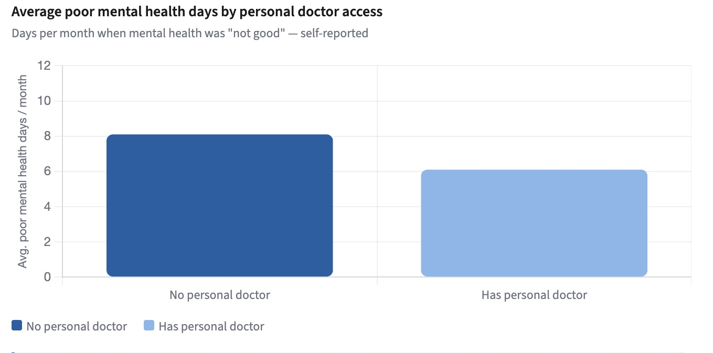
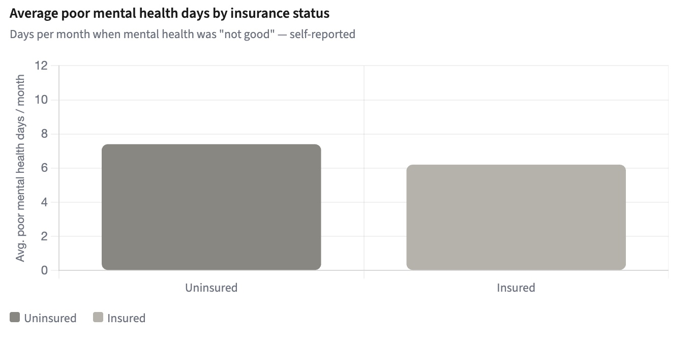

# Healthcare Access & Mental Health Outcomes Analysis

## Project Overview

This healthcare analytics project examines the relationship between healthcare access factors and mental health outcomes using publicly available public health datasets.

The analysis focuses on whether healthcare affordability, insurance coverage, and access to a personal healthcare provider are associated with increased mental health burden among adults.

## Research Question

To what extent do healthcare access factors (insurance coverage, affordability, and access to a primary care provider) relate to mental health burden among adults?

## Objectives

* Evaluate key healthcare access indicators
* Identify patterns associated with mental health burden
* Explore relationships between access barriers and health outcomes
* Communicate findings through visualizations and data storytelling

## Tools & Technologies

* Python
* Pandas
* NumPy
* Google Colab (Python)
* Matplotlib
* Git/GitHub

## Skills Demonstrated

* Data Cleaning
* Exploratory Data Analysis (EDA)
* Healthcare Analytics
* Public Health Analytics
* Data Visualization
* Research Question Development
* Statistical Analysis
* Data Storytelling

## Methodology

1. Collected and reviewed public health datasets
2. Cleaned and validated data for analysis
3. Performed exploratory data analysis (EDA)
4. Created visualizations to identify trends and relationships
5. Interpreted findings and developed recommendations

## Key Findings

- Uninsured adults reported higher average mental health burden than insured adults.
- Adults without a personal healthcare provider reported more poor mental health days than those with a personal provider.
- Healthcare access barriers may contribute to increased mental health burden and highlight opportunities for targeted interventions.
  
## Sample Visualizations

### Adults Without a Personal Doctor Report More Poor Mental Health Days

### Uninsured Adults Report Higher Mental Health Burden

## Project Files

- Analysis Notebook: `notebooks/Healthcare_Access_Mental_Health_Analysis.ipynb`
- Visualizations: `visuals/`
- Dataset Documentation: `data/`

## Data Sources

* CDC Behavioral Risk Factor Surveillance System (BRFSS)
* CDC PLACES Data
* California Health Care Foundation (CHCF)

## Data Privacy

This repository does not contain confidential, proprietary, or patient-level information. All analysis is based on publicly available datasets and is shared for educational and portfolio purposes.

## Repository Structure

* notebooks/ – Analysis notebook and supporting code
* visuals/ – Charts and visual outputs
* data/ – Dataset documentation and source references

## About This Project

This project was completed as part of a Healthcare Data Analytics Externship through Extern and demonstrates the application of healthcare analytics, public health research, and data storytelling techniques to support data-informed decision-making.
